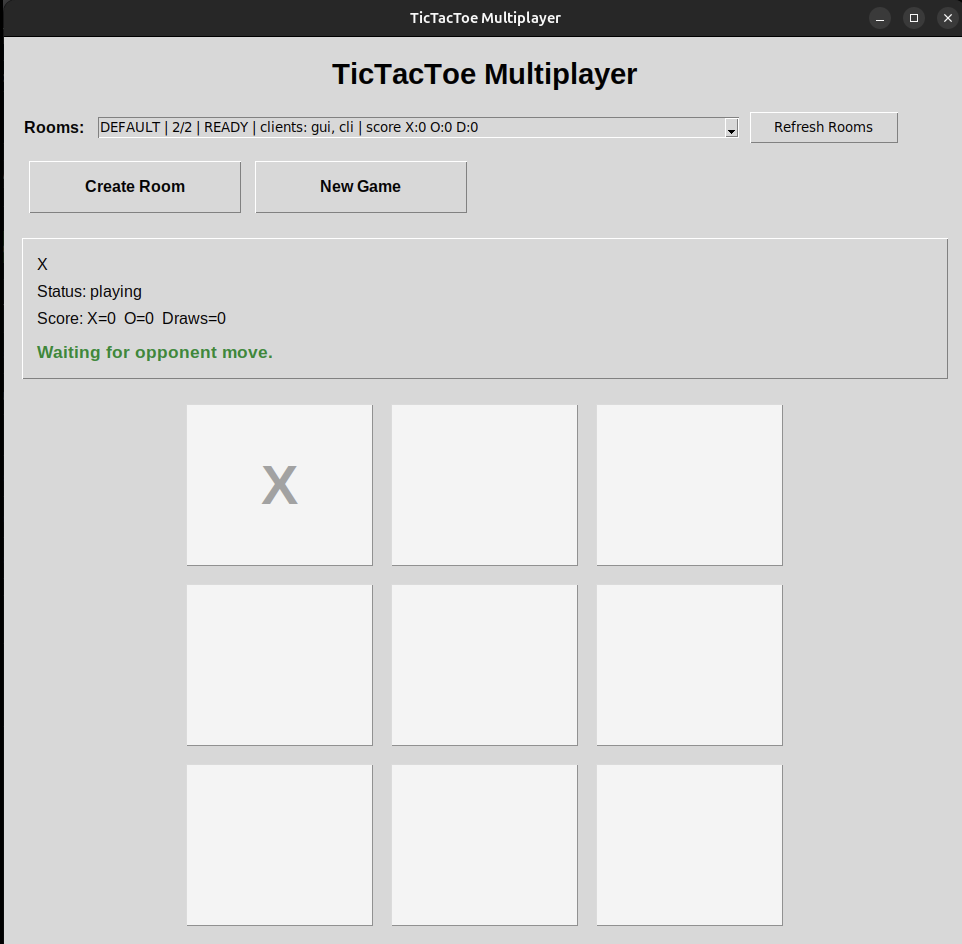
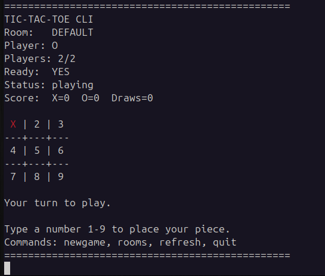

# TicTacToe Multiplayer Engine

A **room-based multiplayer Tic-Tac-Toe engine** built with a Python **FastAPI server** and multiple clients.

This project demonstrates a simple **client-server multiplayer architecture** with support for:

- Linux **CLI client**
- Linux **Tkinter GUI client**
- **Android client**
- Room-based matchmaking
- Score tracking across rounds
- Default auto-join room
- Multiple simultaneous rooms
- New game without leaving the room

The goal of this repository is to provide a **simple multiplayer game engine example** that can run locally or be deployed to the cloud.

---

# Features

- FastAPI multiplayer game server
- Room-based multiplayer matchmaking
- Default room + custom rooms
- CLI client for terminal gameplay
- GUI client for desktop gameplay
- Android client support
- Score tracking
- New Game functionality
- Automatic room cleanup when players leave
- Colored GUI pieces (Red **X**, Blue **O**)

---

# Project Structure

``
tictactoe-multiplayer-engine/
├── AndroidApp/
│
├── client.py
│   CLI + GUI client application
│
├── main.py
│   FastAPI multiplayer game server
│
├── requirements.txt
│   Python dependencies
│
├── README.md
│
└── .gitignore
``

---

# Requirements

- Python **3.10+**
- pip
- Tkinter (for GUI client)
- Android Studio (optional for Android client)

Ubuntu install example:

``
sudo apt update
sudo apt install python3-tk
``

---

# Install

Clone the repository:

``
git clone https://github.com/assix/tictactoe-multiplayer-engine.git
cd tictactoe-multiplayer-engine
``

Create a Python virtual environment:

``
python3 -m venv .venv
source .venv/bin/activate
``

Install dependencies:

``
pip install -r requirements.txt
``

---

# Run the Server

Start the FastAPI game server:

``
uvicorn main:app --reload --host 0.0.0.0 --port 8000 --no-access-log
``

When the server starts it automatically creates the **DEFAULT room**.

---

# Run the Client

## GUI Mode

``
python3 client.py
``

or explicitly:

``
python3 client.py --mode gui
``

---

## CLI Mode

``
python3 client.py --mode cli
``

---

## Connect to a Remote Server

``
python3 client.py --server https://your-render-app.onrender.com
``

---

# How to Play

## GUI Client

1. Start the server
2. Launch the GUI client
3. The client will try to **auto-join the DEFAULT room**
4. Select another room from the dropdown to switch
5. Click **Create Room** to create a new room
6. Click **New Game** to restart the match

Gameplay is turn-based:

- **Red X**
- **Blue O**

---

## CLI Client

When the CLI starts:

Press **Enter** to auto-join the default room.

Board layout:

``
 1 | 2 | 3
---+---+---
 4 | 5 | 6
---+---+---
 7 | 8 | 9
``

Example move:

``
> 5
``

Other commands:

``
newgame
rooms
refresh
quit
``

---

# Screenshots

Add your screenshots in a folder like this:

``
screenshots/
├── gui.png
└── cli.png
``

Then reference them here:

### GUI Client

### CLI Client

---

# Deploying the Server to Render

You can easily host the multiplayer server using **Render**.

Render supports automatic deployments from GitHub and provides a public URL for your server.

https://render.com

---

## Render Deployment Steps

1. Push this repository to GitHub

2. Go to **Render Dashboard**

3. Click

``
New → Web Service
``

4. Connect your GitHub repository

5. Use the following settings:

Build Command

``
pip install -r requirements.txt
``

Start Command

``
uvicorn main:app --host 0.0.0.0 --port $PORT --no-access-log
``

6. Deploy

Your server will be available at something like:

``
https://tictactoe-multiplayer-engine.onrender.com
``

Clients can connect using:

``
python3 client.py --server https://your-render-url.onrender.com
``

---

# Suggested GitHub Topics

Add these to your repository topics:

``
tictactoe
multiplayer
fastapi
python
game-server
client-server
tkinter
cli
android
render
``

---

# Future Improvements

Possible extensions:

- WebSocket real-time updates
- Persistent database for rooms
- User accounts
- Spectator mode
- Web browser client
- Docker deployment
- Kubernetes scaling

---

# License

MIT License

---

# Author

Created by **assix**

GitHub: https://github.com/assix
